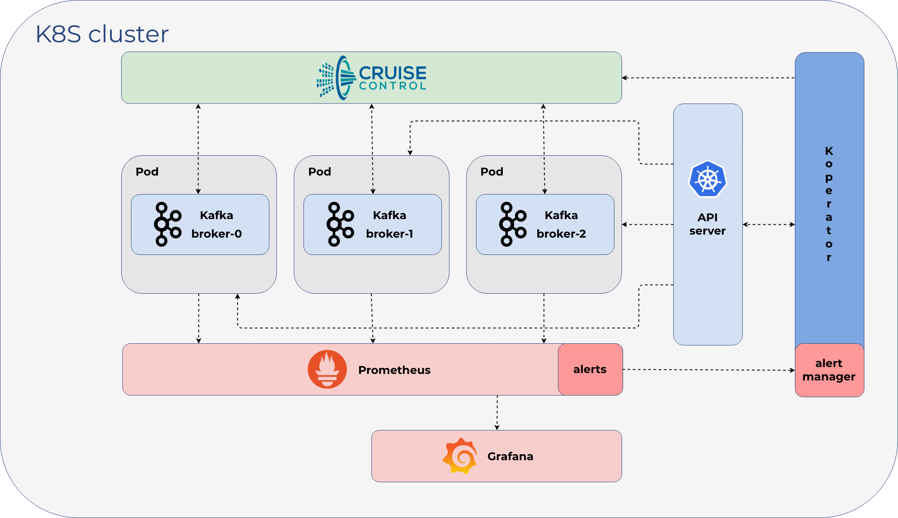

  

  

  

  

# Koperator

Koperator (formerly called Kafka Operator) is an operator for managing Apache Kafka on Kubernetes that automates the provisioning, management, and autoscaling of [Apache Kafka](https://kafka.apache.org) clusters deployed to K8s.

## Overview

Apache Kafka is an open-source distributed streaming platform, and some of the main features of the **Koperator** are:

- the provisioning of secure and production ready Kafka clusters
- **fine grained** broker configuration support
- advanced and highly configurable External Access via LoadBalancers using **Envoy**
- graceful Kafka cluster **scaling and rebalancing**
- monitoring via **Prometheus**
- encrypted communication using SSL
- automatic reaction and self healing based on alerts (plugin system, with meaningful default alert plugins) using **Cruise Control**
- graceful rolling upgrade
- advanced topic and user management via CRD

>We took a different approach to what's out there - we believe for a good reason - please read on to understand more about our [design motivations](docs/features.md) and some of the [scenarios](docs/scenarios.md) which were driving us to create Koperator.

**Koperator** is a core part of [Banzai Cloud Supertubes](https://banzaicloud.com/products/supertubes/) (now called Cisco Streaming Data Manager) that helps you create production-ready Apache Kafka clusters on Kubernetes, with scaling, rebalancing, and alerts based self healing. While the Koperator itself is an open-source project, the [Banzai Cloud Supertubes](https://banzaicloud.com/products/supertubes/) product extends the functionality of Koperator with commercial features (for example, built-in monitoring and multiple ways of disaster recovery). Read a [detailed comparison of Supertubes and Koperator](https://banzaicloud.com/docs/supertubes/kafka-operator-supertubes-feature-comparison/).

## Installation

For detailed installation instructions, see the [Banzai Cloud Documentation Page](https://banzaicloud.com/docs/supertubes/kafka-operator/install-kafka-operator/).

## Documentation

The documentation of the Koperator project is available at the [Banzai Cloud Documentation Page](https://banzaicloud.com/docs/supertubes/kafka-operator/).

## Support

**Koperator** is a core part of [Banzai Cloud Supertubes](https://banzaicloud.com/products/supertubes/) that helps you create production-ready Apache Kafka clusters on Kubernetes, with scaling, rebalancing, and alerts based self healing. While the Koperator itself is an open-source project, the [Banzai Cloud Supertubes](https://banzaicloud.com/products/supertubes/) product extends the functionality of Koperator with commercial features (for example, built-in monitoring and multiple ways of disaster recovery). Read a [detailed comparison of Supertubes and the Koperator](https://banzaicloud.com/docs/supertubes/kafka-operator-supertubes-feature-comparison/).

### Community support

If you encounter problems while using Koperator that the documentation does not address, [open an issue](https://github.com/banzaicloud/koperator/issues) or talk to us on the Banzai Cloud Slack channel [#kafka-operator](https://pages.banzaicloud.com/invite-slack).

### Commercial support

If you are using Koperator in a production environment and [require commercial support, contact Banzai Cloud](https://banzaicloud.com/contact/), the company backing the development of Koperator.

## Contributing

If you find this project useful, help us:

- Support the development of this project and star this repo! :star:
- If you use Koperator in a production environment, add yourself to the list of production [adopters](https://github.com/banzaicloud/koperator/blob/master/ADOPTERS.md).:metal:  
- Help new users with issues they may encounter :muscle:
- Send a pull request with your new features and bug fixes :rocket:

When you are opening a PR to Koperator the first time we will require you to sign a standard CLA. Check out the [developer docs](docs/developer.md).

## License

Copyright (c) 2019 [Banzai Cloud, Inc.](https://banzaicloud.com)

Licensed under the Apache License, Version 2.0 (the "License");
you may not use this file except in compliance with the License.
You may obtain a copy of the License at

[http://www.apache.org/licenses/LICENSE-2.0](http://www.apache.org/licenses/LICENSE-2.0)

Unless required by applicable law or agreed to in writing, software
distributed under the License is distributed on an "AS IS" BASIS,
WITHOUT WARRANTIES OR CONDITIONS OF ANY KIND, either express or implied.
See the License for the specific language governing permissions and
limitations under the License.

## Trademarks

Apache Kafka, Kafka, and the Kafka logo are either registered trademarks or trademarks of The Apache Software Foundation in the United States and other countries.

The Banzai Cloud name, the Banzai Cloud logo, and all Banzai Cloud trademarks and logos are registered trademarks of Cisco.
