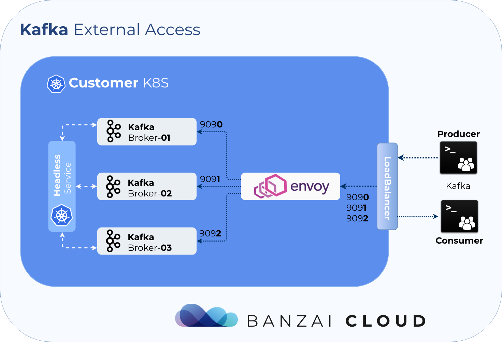
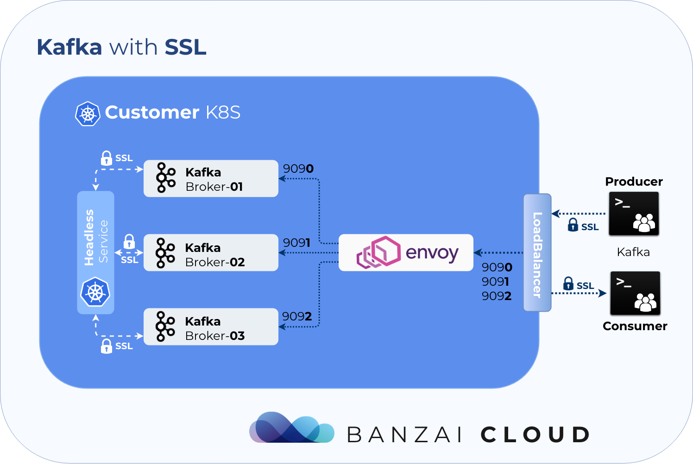

Kafka is a stateful application. The first piece of the puzzle is the Broker, which is a simple server capable of createing/forming a cluster with other Brokers. Every Broker has his own **unique** configuration which differs slightly from all others - the most relevant of which is the ***unique broker ID***.

All Kafka on Kubernetes operators use [StatefulSet](https://kubernetes.io/docs/concepts/workloads/controllers/statefulset/) to create a Kafka Cluster. Just to quickly recap from the K8s docs:

>StatefulSet manages the deployment and scaling of a set of Pods, and provide guarantees about their ordering and uniqueness. Like a Deployment, a StatefulSet manages Pods that are based on an identical container spec. Unlike a Deployment, a StatefulSet maintains sticky identities for each of its Pods. These pods are created from the same spec, but are not interchangeable: each has a persistent identifier that is maintained across any rescheduling.

How does this looks from the perspective of Apache Kafka?

With StatefulSet we get:
- unique Broker IDs generated during Pod startup
- networking between brokers with headless services
- unique Persistent Volumes for Brokers

Using StatefulSet we **lose:**
- the ability to modify the configuration of unique Brokers
- to remove a specific Broker from a cluster (StatefulSet always removes the most recently created Broker)
- to use multiple, different Persistent Volumes for each Broker

The Banzai Cloud Kafka Operator uses `simple` Pods, ConfigMaps, and PersistentVolumeClaims, instead of StatefulSet. Using these resources allows us to build an Operator which is better suited to Kafka.

With the Banzai Cloud Kafka operator we can:
- modify the configuration of unique Brokers
- remove specific Brokers from clusters
- use multiple Persistent Volumes for each Broker

## Features

To highligt some of the features we needed and were not possible with the operators available, please keep reading (I know, I know, this post is getting long).

### Fine Grained Broker Config Support

We needed to be able to react to events in a fine-grained way for each Broker - and not in the limited way StatefulSet does (which, for example, removes the most recently created Brokers). Some of the available solutions try to overcome these deficits by placing scripts inside the container to generate configs at runtime, whereas the Banzai Cloud Kafka operator's configurations are deterministically placed in specific Configmaps.

#### Graceful Kafka Cluster Scaling

Here at Banzai Cloud, we know how to operate Kafka at scale (we are contributors and have been operating Kafka on Kubernetes for years now). We believe, however, that LinkedIn has even more experience than we do. To scale Kafka clusters both up and down gracefully, we integrated LinkedIn's [Cruise-Control](https://github.com/linkedin/cruise-control) to do the hard work for us. We already have good defaults (i.e. plugins) that react to events, but we also allow our users to write their own.

#### External Access via LoadBalancer

The Banzai Cloud Kafka operator externalizes access to Kafka using a dynamically (re)configured Envoy proxy. Using Envoy allows us to use **a single** LoadBalancer, so there's no need for a LoadBalancer for each Broker.

#### Communication via SSL

The operator fully automates Kafka's SSL support.
The operator can provision the required secrets and certificates for you, or you can provide your own.
The Pipeline platform is capable of automating this process, as well.

#### Monitoring via Prometheus

The Kafka operator exposes Cruise-Control and Kafka JMX metrics to Prometheus.

#### Reacting on Alerts

The Kafka Operator acts as a **Prometheus Alert Manager**. It receives alerts defined in Prometheus, and creates actions based on Prometheus alert annotations.

Currently, there are three default actions (which can be extended):
- upscale cluster (add a new Broker)
- downscale cluster (remove a Broker)
- add additional disk to a Broker

#### Graceful Rolling Upgrade

Operator supports graceful rolling upgrade, It means the operator will check if the cluster is healthy.
It basically checks if the cluster has offline partitions, and all the replicas are in sync.
It proceeds only when the failure threshold is smaller than the configured one.

The operator also allows to create special alerts on Prometheus, which affects the rolling upgrade state, by
increasing the error rate.

#### Dynamic Configuration Support

Kafka operates with three type of configs:

- Read-only
- ClusterWide
- PerBroker

Read only config requires broker restart to update all the others may be updated dynamically.
Operator CRD distinguishes these fields, and proceed with the right action. It can be a rolling upgrade, or
a dynamic reconfiguration.
